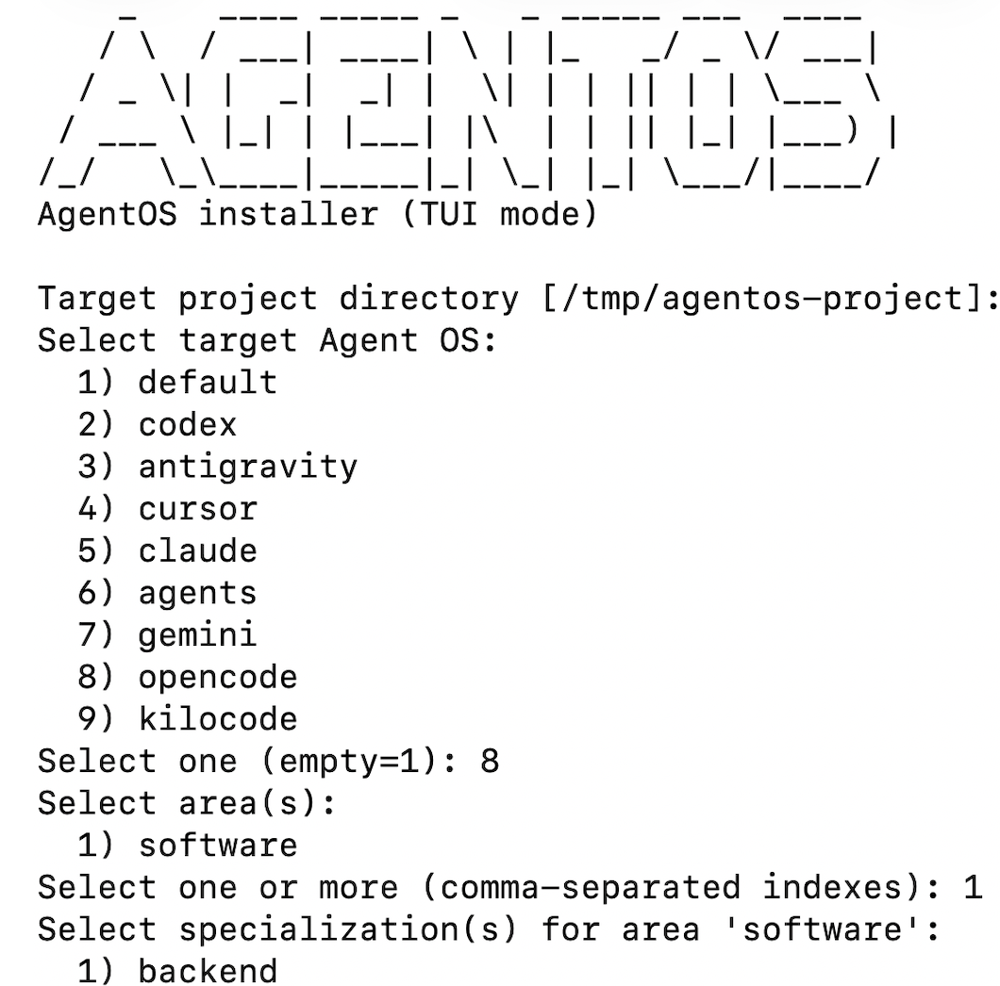

# agent-guides


A unified catalog of AgentOS specializations and the `agentos-install.sh` installer.

## Repository structure

```text
source specializations (repository tree):
  software/
    backend/
    frontend/
    data-engineering/
    full-stack/
    mlops/
    mobile/
    platform/
    qa/
    security/
extensions/
```

## Goals

- Provide a consistent `.agent/` layout for each specialization.
- Supply reusable rules, skills, workflows, and prompts.
- Keep guidance practical for real SDLC delivery.

## How to use

1. Pick a specialization directory under `areas/software/*`.
2. Copy or adapt the guidance into your target project `.agent/` tree.
3. Tailor prompts and workflows to your stack and team constraints.
