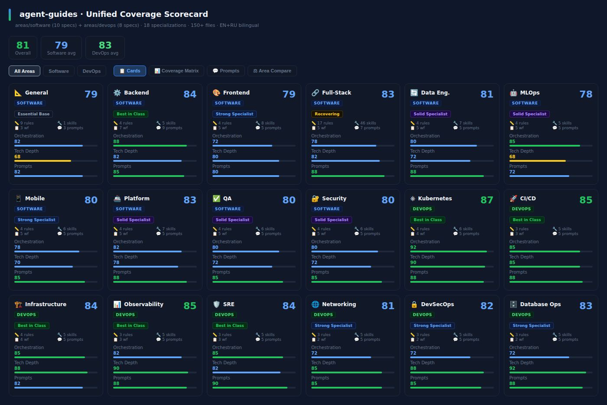

# agent-guides


A unified catalog of AgentOS specializations and the `agentos-install.sh` installer. Provides orchestrator-ready rules,
skills, workflows, and prompts that any AI agent can load in a target project.

- [coverage score card](https://claude.ai/public/artifacts/8177bc3d-3b2f-48a6-8232-47c5b02b20f3)

---

## Repository structure

```text
agent-guides/
├── areas/
│   ├── software/
│   │   ├── general/          # Cross-cutting rules and workflows (always useful to include)
│   │   ├── backend/          # Backend service development
│   │   ├── frontend/         # Frontend/UI development
│   │   ├── full-stack/       # Full-stack with layered architecture focus
│   │   ├── data-engineering/ # dbt, warehouses, pipelines
│   │   ├── mlops/            # Model training, evaluation, deployment
│   │   ├── mobile/           # iOS / Android / React Native
│   │   ├── platform/         # Infra, Terraform, K8s, CI/CD, incidents
│   │   ├── qa/               # Test strategy, flakiness, performance, coverage
│   │   └── security/         # Scans, threat modeling, secret rotation, compliance
│   └── devops/
│       ├── kubernetes/       # Cluster bootstrap, workload ops, RBAC, upgrades
│       ├── ci-cd/            # GitHub Actions, GitLab CI, quality gates, supply chain
│       ├── infrastructure/   # Terraform, Ansible, IaC standards, drift detection
│       ├── observability/    # Prometheus, Loki, Tempo, Grafana, SLO tracking
│       ├── sre/              # SLOs, error budgets, incidents, chaos engineering
│       ├── networking/       # Ingress, TLS, service mesh, DNS, VPC design
│       ├── devsecops/        # Shift-left, SBOM, OPA/Kyverno, container hardening
│       └── database-ops/     # PostgreSQL, Redis, migrations, backup/restore
├── extensions/
│   ├── opencode/             # opencode commands, agents, skills, plugins
│   ├── claude/               # Claude-specific configs
│   └── ...
├── docs/                     # Setup guides, design docs
├── agentos-install.sh        # Installer script
└── AGENTS.md                 # Root agent guidance (loaded into every project)
```

Each specialization follows a consistent layout:

```text
<specialization>/
├── AGENTS.md          # Specialization-specific agent guidance
├── rules/             # Constraints and conventions (always loaded)
├── skills/            # Technical capabilities (loaded on demand)
├── workflows/         # Orchestrated step-by-step processes (loaded on /command)
└── prompts/           # Human-copy-paste templates (bilingual EN + RU)
```

---

## How to use the installer

### TUI mode (interactive)

```bash
./agentos-install.sh tui
```

Launches a guided terminal UI to select project directory, agent OS, area, and specializations.

### CLI mode

```bash
./agentos-install.sh install \
  --project-dir /path/to/your-project \
  --agent-os opencode \
  --areas software \
  --specializations software.general,software.backend
```

### Options

| Flag                | Required | Description                                                                 |
|---------------------|----------|-----------------------------------------------------------------------------|
| `--project-dir`     | ✅        | Target project directory (created if missing)                               |
| `--agent-os`        | —        | Target agent environment (default: `default`)                               |
| `--areas`           | ✅        | Comma-separated area list (e.g. `software`)                                 |
| `--specializations` | ✅        | Comma-separated `area.spec` list (e.g. `software.backend,software.general`) |
| `--dry-run`         | —        | Show planned actions without writing files                                  |

### List available options

```bash
./agentos-install.sh list agentos        # Available agent OS targets
./agentos-install.sh list areas          # Available areas
./agentos-install.sh list specs --area software   # Specializations within an area
```

---

## What gets installed where

The installer copies selected rules, skills, workflows, and prompts into the target project. Destination directories
depend on `--agent-os`:

| Agent OS   | rules             | skills             | workflows            | prompts          |
|------------|-------------------|--------------------|----------------------|------------------|
| `default`  | `.agent/rules`    | `.agent/skills`    | `.agent/workflows`   | `.agent/prompts` |
| `opencode` | `.opencode/rules` | `.opencode/skills` | `.opencode/commands` | _(skipped)_      |
| `cursor`   | `.cursor/rules`   | `.cursor/skills`   | _(skipped)_          | _(skipped)_      |
| `claude`   | `.agent/rules`    | `.agent/skills`    | `.agent/workflows`   | `.agent/prompts` |

In addition, the `extensions/<agent-os>/` directory is copied to `.<agent-os>/` in the target project (e.g.
`extensions/opencode/` → `.opencode/`).

An `AGENTS.md` is generated at the root of the target project, assembled from:

- Root `AGENTS.md` (shared guidance)
- Each selected specialization's `AGENTS.md`

---

## `general` specialization

`general` contains cross-cutting rules and workflows applicable to any software project regardless of stack:

- **Rules:** git workflow, code style, Makefile conventions, Docker Compose, CI/CD, linting, SDLC methodology, role
  responsibilities
- **Workflows:** `/dev` (development cycle), `/code-review`, `/project-setup`

**Recommendation:** always include `general` alongside any specialization:

```bash
--specializations software.general,software.backend
```

When `general` is installed, its rules are available to all specialization workflows. Each specialization is designed to
be standalone (does not assume `general` is present), but combining them avoids re-stating cross-cutting conventions in
each specialization.

---

## Workflow format

Every workflow file follows this schema:

```yaml
---
name: <workflow-name>
type: workflow
trigger: /<command>          # Invocation command (e.g. /develop-feature)
description: <one sentence>
inputs: [ ... ]
outputs: [ ... ]
roles: [ subagents used ]
related-rules: [ rule files referenced in steps ]
uses-skills: [ skills loaded during this workflow ]
quality-gates: [ exit criteria ]
---

## Steps

### 1. <Step Name> — `@owner`
- **Input:** ...
- **Actions:** ...
- **Output:** `<artifact>`
- **Done when:** ...

## Iteration Loop
...

## Exit
...
```

Workflows are designed for the **orchestrator agent**: they provide explicit per-step ownership (`@role`), inputs,
outputs, and done-criteria. Technical details are referenced via `uses-skills` — agents load skill files only when a
step requires them, minimizing token consumption.

---

## Prompt format

Prompts are **human-facing templates** for copy-paste into an agent. Each prompt file contains:

- 2–3 examples covering different scenarios (detailed / minimal)
- Bilingual: English + Russian per example

Prompts map 1:1 to workflow triggers:

```
prompts/develop-feature.md  →  /develop-feature workflow
prompts/add-migration.md    →  /add-migration workflow
```

---

## Token budget guidance

To minimize token consumption per agent session:

1. **`AGENTS.md` is the entry point** — keep it concise; reference files by path, do not inline content
2. **Rules are always-on** — loaded once at session start; keep individual rule files focused (one topic per file)
3. **Skills are on-demand** — workflows reference skills explicitly; agents load them only when the relevant step is
   active
4. **Workflows are loaded on command** — only the invoked workflow is read; other workflows stay unloaded
5. **Avoid `general` + specialization rule duplication** — if a rule exists in `general/`, remove it from the
   specialization; do not load the same content twice

---

## Adding a new specialization

See `areas/template/README.md` for the template structure. Required files per new specialization:

```text
areas/software/<new-spec>/
├── AGENTS.md
├── rules/       (min 1 file)
├── skills/      (min 1 SKILL.md)
├── workflows/   (min 1 .md)
└── prompts/     (min 1 .md, bilingual)
```

---

## Adding a new agent OS extension

1. Create `extensions/<agent-os>/` directory
2. Add agent configs, commands, and plugins
3. Add entry to `AGENT_DIR_MAP` in `agentos-install.sh` with directory mappings:
   ```bash
   AGENT_DIR_MAP[myagent]=".<myagent>/rules .<myagent>/skills .<myagent>/commands -"
   ```
4. Use `-` for any bucket not supported by the agent OS

---

## Sub-agents

When using opencode (or other multi-agent environments), the following sub-agents are available in
`extensions/opencode/agents/`:

| Agent            | Role                                                                  |
|------------------|-----------------------------------------------------------------------|
| `@product-owner` | Value, scope, acceptance — primary orchestrator                       |
| `@pm`            | Delivery planning, dependency management, stakeholder communication   |
| `@team-lead`     | Technical strategy, architecture, quality gates, engineering sign-off |
| `@developer`     | Implementation, unit tests, maintainable delivery                     |
| `@qa`            | Verification strategy, test execution, quality recommendation         |
| `@designer`      | UX quality, interaction design, accessibility                         |

Workflows reference these agents by `@role` in each step's **Owner** field.
